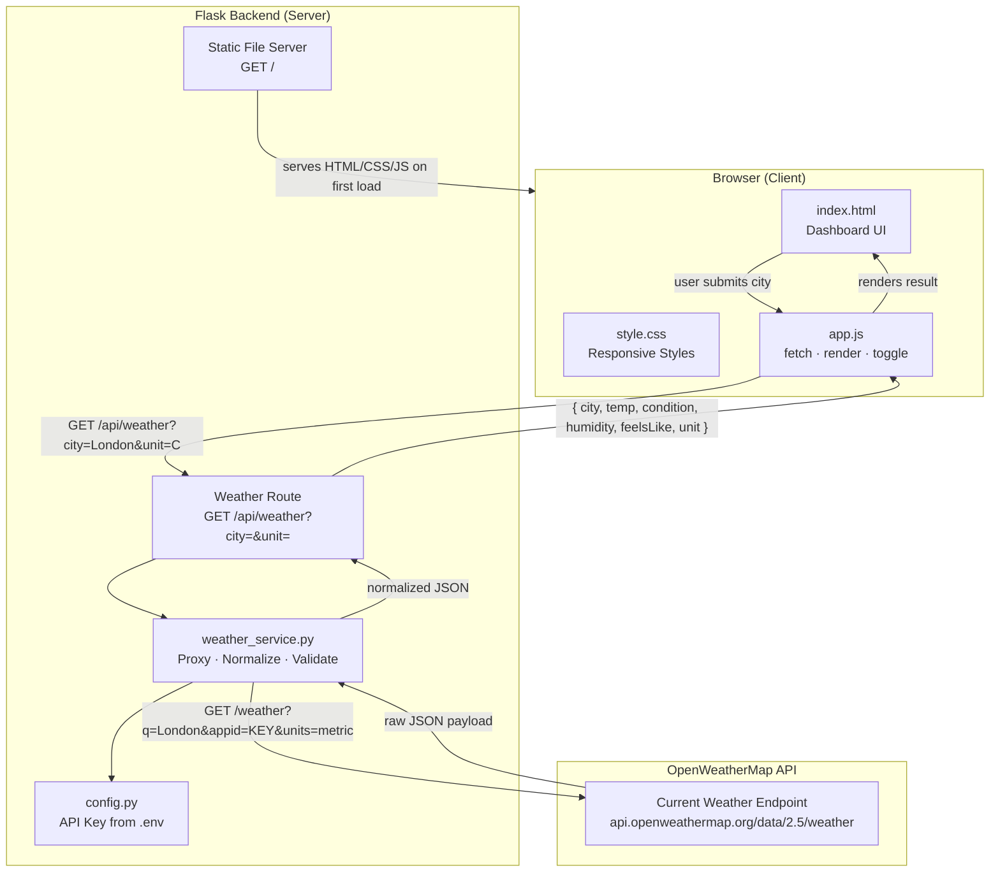
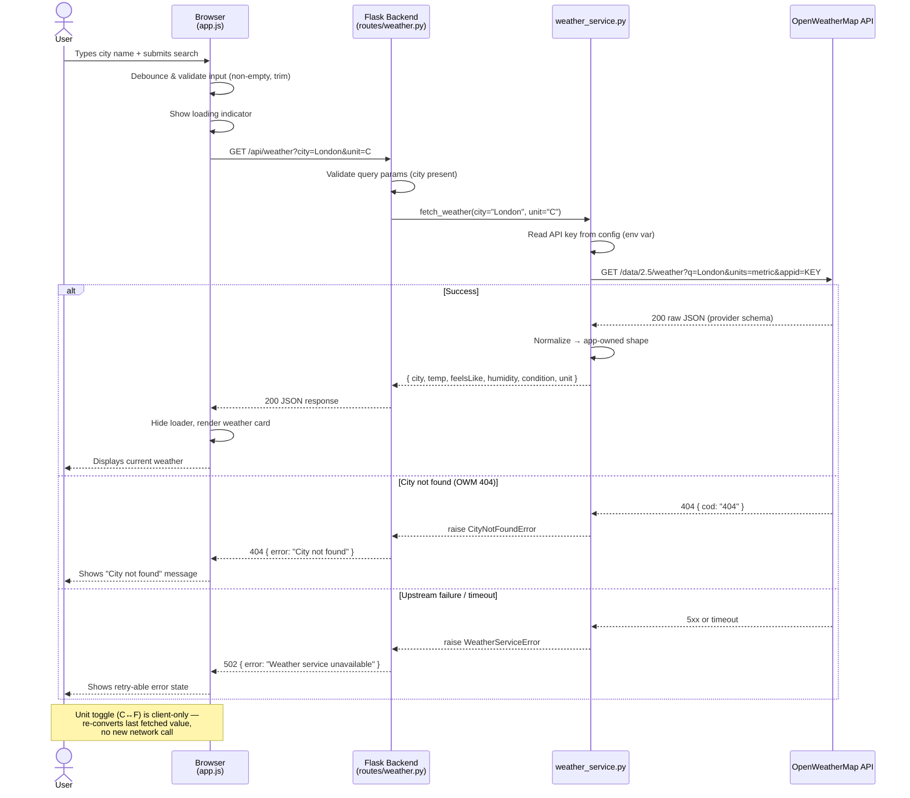

## Architecture Diagram and Data Flow — Weather Dashboard Flask App

### Architecture Diagram



---

### Data Flow — Sequence Diagram



---

### Key Design Decisions

| Concern | Decision |
|---|---|
| API key location | Only in Flask `config.py` loaded from `.env` — never in the browser |
| Provider schema coupling | `weather_service.py` normalizes before returning — frontend never sees OWM's raw shape |
| Unit toggle | Client-side conversion from the last cached response — avoids a redundant round-trip |
| Error surface | Three distinct failure paths (city not found, service error, timeout) each return a typed JSON error |
| Static assets | Flask serves `index.html`, `style.css`, and `app.js` on first load from the same origin, eliminating CORS entirely |

---

### Normalized JSON Response Contract

**Success — 200**
```json
{
  "city": "London",
  "country": "GB",
  "temp": 15,
  "feelsLike": 12,
  "humidity": 72,
  "condition": "Cloudy",
  "unit": "C",
  "timestamp": "2026-06-16T10:30:00Z"
}
```

**City not found — 404**
```json
{ "error": "City not found" }
```

**Service unavailable — 502**
```json
{ "error": "Weather service unavailable" }
```
